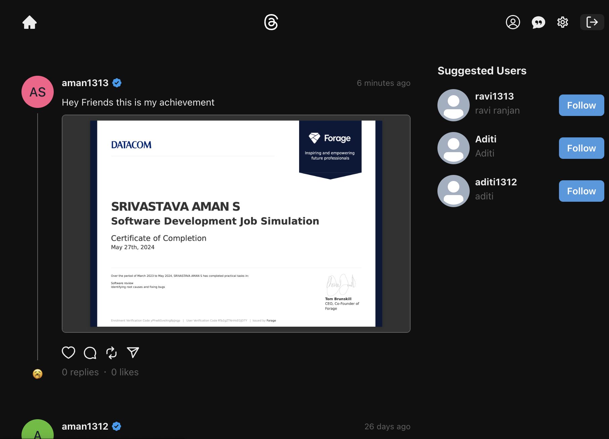
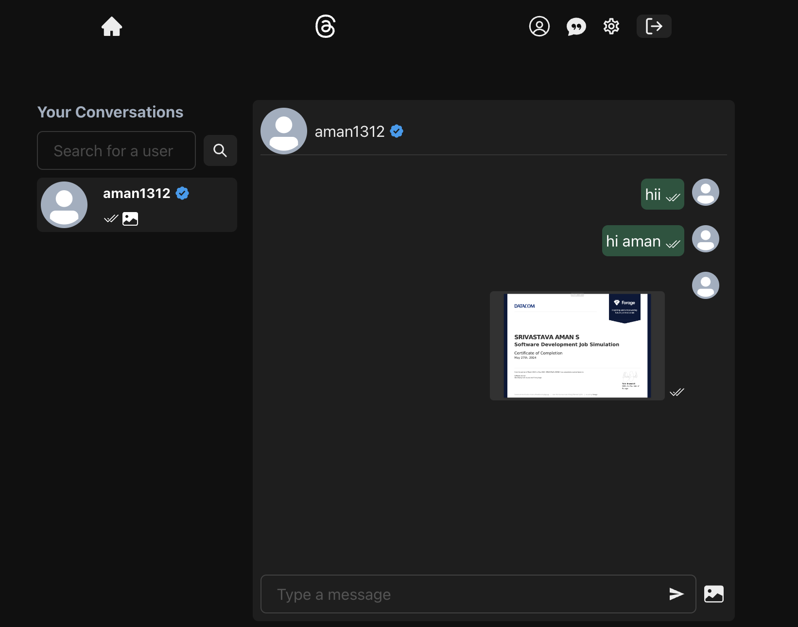
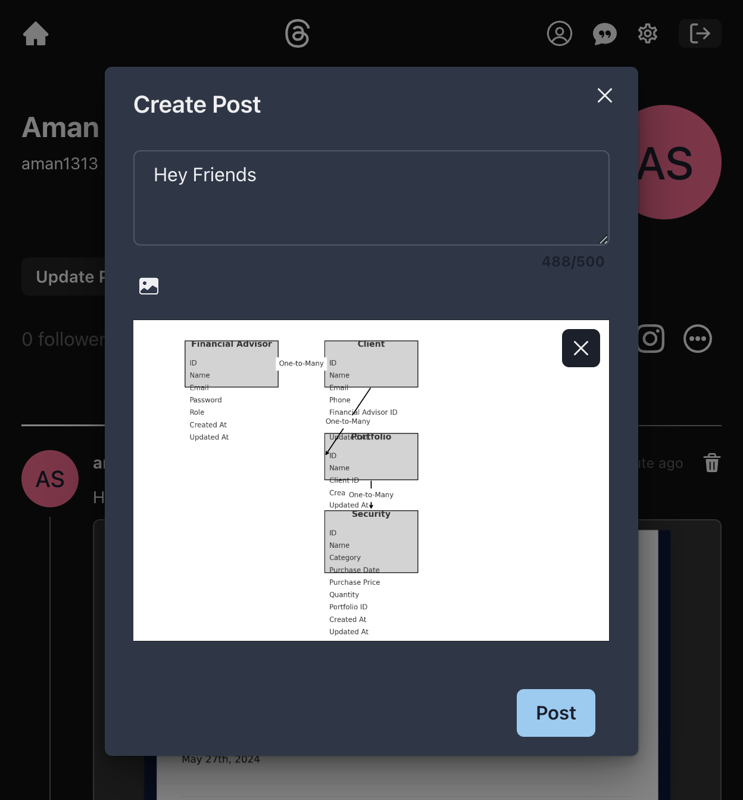
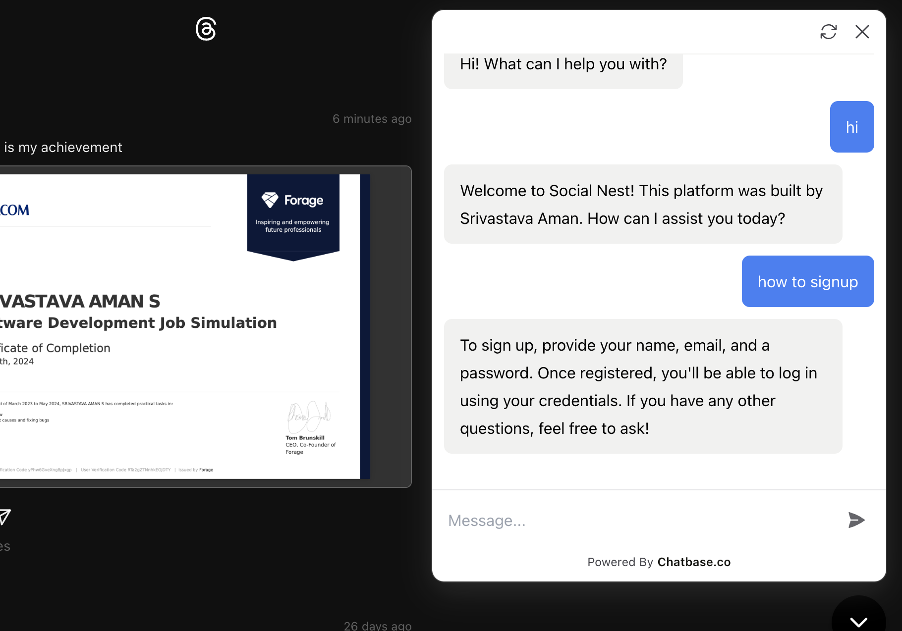

# SocialNest

Welcome to My Social Media App! This project is a feature-rich, fully responsive social media platform that allows users to create posts, interact with other users, and more.

## Features

- 🎃 **Authentication & Authorization with JWT**: Secure login and registration system using JSON Web Tokens.
- 📝 **Create Post**: Users can create new posts and share them with their followers.
- 🗑️ **Delete Post**: Users can delete their posts if they no longer wish to share them.
- ❤️ **Like/Unlike Post**: Users can like or unlike posts to show their appreciation.
- 💬 **Comment to a Post**: Users can comment on posts to engage in discussions.
- 👥 **Follow/Unfollow Users**: Users can follow or unfollow other users to curate their feed.
- ❄️ **Freeze Your Account**: Users can freeze their accounts, disabling their activity without deleting their data.
- 🌓 **Dark/Light Mode**: Users can switch between dark and light themes for a better user experience.
- 📱 **Completely Responsive**: The app is fully responsive, providing a seamless experience on any device.
- 💬 **Chat App With Image Support**: Users can chat with each other and send images.
- 👀 **Seen/Unseen Status for Messages**: Users can see if their messages have been read by the recipient.

## Table of Contents

- [Installation](#installation)
- [Usage](#usage)
- [Screenshots](#screenshots)
- [Technologies Used](#technologies-used)
- [Contributing](#contributing)
- [License](#license)

## Installation

1. Clone the repository:

   ```bash
   git clone https://github.com/yourusername/your-repo-name.git
   cd your-repo-name
   ```

2. Install the dependencies:

   ```bash
   npm run build
   ```

3. Set up the environment variables. Create a `.env` file in the root directory and add the following:

   ```env
   PORT=4000
   MONGODB_URI=your_mongodb_connection_string
   JWT_SECRET=your_jwt_secret
   CLOUDINARY_CLOUD_NAME=
   CLOUDINARY_API_KEY=
   CLOUDINARY_API_SECRET=
   ```

4. Start the development server:

   ```bash
   npm start
   ```

5. Open your browser and navigate to `http://localhost:4000`.

## Usage

1. Register a new account or log in with an existing account.
2. Create a post by clicking on the "Create Post" button.
3. Interact with posts by liking, commenting, or deleting them.
4. Follow or unfollow other users to customize your feed.
5. Use the chat feature to send messages and images to other users.
6. Switch between dark and light modes using the theme toggle.
7. Freeze your account if you need a break without losing your data.

## Screenshots

# Homepage with User Feed Post and Suggested User List



# ChatPage



# Create Post



# Chatbot for Assistance



## Technologies Used

- **Frontend**: React, Recoil, Chakra-UI
- **Backend**: Node.js, Express.js
- **Database**: MongoDB
- **Authentication**: JWT (JSON Web Tokens)
- **Real-time Communication**: Socket.io
- **Styling**: CSS, Chakra-UI

## Contributing

Contributions are welcome! Please follow these steps:

1. Fork the repository.
2. Create a new branch (`git checkout -b feature-branch`).
3. Make your changes and commit them (`git commit -m 'Add some feature'`).
4. Push to the branch (`git push origin feature-branch`).
5. Create a new Pull Request.

---

We hope you enjoy using My Social Media App! If you have any questions or feedback, please feel free to open an issue or reach out to us.

# Happy coding! 🚀
